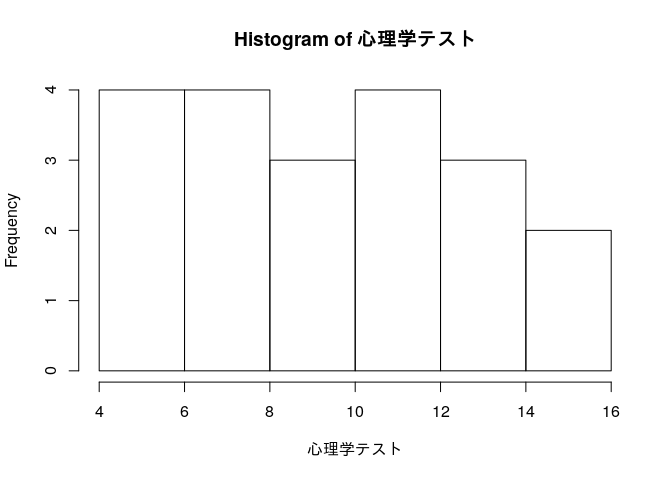

# 第2章 1つの変数の記述統計

## 2.4 データの視覚的表現

``` r
指導法 <- c("C","B","B","A","B","C","A","D","D","D","A", "A","A","C","B","D","C","C","B","D")
```

``` r
table(指導法)
```

    ## 指導法
    ## A B C D 
    ## 5 5 5 5

``` r
心理学テスト <- c(13,14,7,12,10,6,8,15,4,14,9,6,10,12,5,12,8,8,12,15)
```

``` r
hist(心理学テスト)
```

<!-- -->

## 2.5 平均とは

``` r
テストa <- c(10,13,8,15,8)
```

``` r
sum(テストa) / length(テストa)
```

    ## [1] 10.8

``` r
mean(テストa)
```

    ## [1] 10.8

## 2.6 平均以外の代表値

``` r
median(テストa)
```

    ## [1] 10

``` r
table(テストa)
```

    ## テストa
    ##  8 10 13 15 
    ##  2  1  1  1

最頻値は8

## 2.8 分散、標準偏差とは

``` r
テストa平均 <- mean(テストa)
テストa平均
```

    ## [1] 10.8

``` r
平均からの偏差 <- テストa - テストa平均
平均からの偏差
```

    ## [1] -0.8  2.2 -2.8  4.2 -2.8

``` r
平均からの偏差の二乗 <- 平均からの偏差^2
平均からの偏差の二乗
```

    ## [1]  0.64  4.84  7.84 17.64  7.84

``` r
平均からの偏差の二乗和 <- sum(平均からの偏差の二乗)
平均からの偏差の二乗和
```

    ## [1] 38.8

標本分散

``` r
データ数 <- length(テストa)

分散 <- 平均からの偏差の二乗和 / データ数
分散
```

    ## [1] 7.76

標準偏差

``` r
sqrt(分散)
```

    ## [1] 2.785678

不偏分散

``` r
var(テストa)
```

    ## [1] 9.7

## 2.9 分散、標準偏差以外の散布度

平均偏差

``` r
mean(abs(テストa - mean(テストa)))
```

    ## [1] 2.56

範囲(レンジ)

``` r
max(テストa) - min(テストa)
```

    ## [1] 7

## 2.10 標準化

``` r
心理学平均 <- mean(心理学テスト)
心理学平均
```

    ## [1] 10

``` r
心理学標準偏差 <- sqrt(mean((心理学テスト - 心理学平均)^2))
心理学標準偏差
```

    ## [1] 3.331666

``` r
心理学z得点 <- (心理学テスト - 心理学平均) / 心理学標準偏差
心理学z得点
```

    ##  [1]  0.9004503  1.2006005 -0.9004503  0.6003002  0.0000000 -1.2006005
    ##  [7] -0.6003002  1.5007506 -1.8009007  1.2006005 -0.3001501 -1.2006005
    ## [13]  0.0000000  0.6003002 -1.5007506  0.6003002 -0.6003002 -0.6003002
    ## [19]  0.6003002  1.5007506

``` r
心理学z得点平均 <- mean(心理学z得点)
心理学z得点平均
```

    ## [1] -2.753874e-18

``` r
心理学z得点標準偏差 <- sqrt(mean((心理学z得点 - 心理学z得点平均)^2))
心理学z得点標準偏差
```

    ## [1] 1

## 2.11 偏差値

``` r
心理学偏差値 <- 10 * 心理学z得点 + 50
心理学偏差値
```

    ##  [1] 59.00450 62.00600 40.99550 56.00300 50.00000 37.99400 43.99700 65.00751
    ##  [9] 31.99099 62.00600 46.99850 37.99400 50.00000 56.00300 34.99249 56.00300
    ## [17] 43.99700 43.99700 56.00300 65.00751
