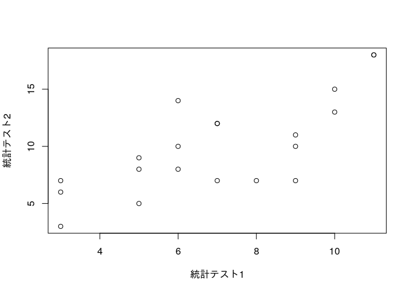
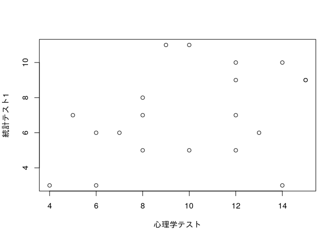
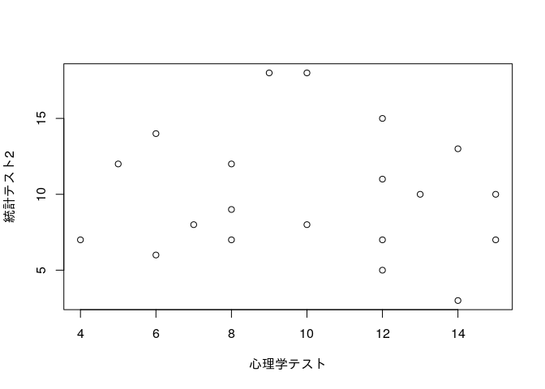

# 第3章 2つの変数の記述統計

## 3.1 2つの変数の関係

量的変数どうしの関係が相関、質的変数どうしの関係が連関

## 3.2 散布図

``` r
統計テスト1 <- c(6,10,6,10,5,3,5,9,3,3,11,6,11,9,7,5,8,7,7,9)
統計テスト2 <- c(10,13,8,15,8,6,9,10,7,3,18,14,18,11,12,5,7,12,7,7)
心理学テスト <- c(13,14,7,12,10,6,8,15,4,14,9,6,10,12,5,12,8,8,12,15)
```

散布図

``` r
plot(統計テスト1, 統計テスト2)
```

<!-- -->

``` r
plot(心理学テスト, 統計テスト1)
```

<!-- -->

``` r
plot(心理学テスト, 統計テスト2)
```

<!-- -->

## 3.3 共分散

共分散は偏差の積の平均

``` r
共分散1と2 <- mean((統計テスト1 - mean(統計テスト1)) * (統計テスト2 - mean(統計テスト2)))
共分散1と2
```

    ## [1] 7.55

不偏共分散

``` r
cov(統計テスト1, 統計テスト2)
```

    ## [1] 7.947368

## 3.4 相関係数

相関係数

``` r
cov(統計テスト1, 統計テスト2) / (sd(統計テスト1) * sd(統計テスト2))
```

    ## [1] 0.749659

``` r
cor(統計テスト1, 統計テスト2)
```

    ## [1] 0.749659

``` r
cor(心理学テスト, 統計テスト1)
```

    ## [1] 0.3826645

``` r
cor(心理学テスト, 統計テスト2)
```

    ## [1] -0.09350516

## 3.5 クロス集計表

``` r
数学 <- c("嫌い","嫌い","好き","好き","嫌い","嫌い","嫌い","嫌い","嫌い","好き","好き","嫌い","好き","嫌い","嫌い","好き","嫌い","嫌い","嫌い","嫌い")
```

``` r
table(数学)
```

    ## 数学
    ## 好き 嫌い 
    ##    6   14

``` r
統計 <- c("好き","好き","好き","好き","嫌い","嫌い","嫌い","嫌い","嫌い","嫌い","好き","好き","好き","嫌い","好き","嫌い","嫌い","嫌い","嫌い","嫌い")
```

``` r
table(統計)
```

    ## 統計
    ## 好き 嫌い 
    ##    8   12

クロス集計表

``` r
table(数学,統計)
```

    ##       統計
    ## 数学 好き 嫌い
    ##   好き    4    2
    ##   嫌い    4   10

## 3.6 ファイ係数

``` r
数学イチゼロ <- ifelse(数学 == "好き", 1, 0)
数学イチゼロ
```

    ##  [1] 0 0 1 1 0 0 0 0 0 1 1 0 1 0 0 1 0 0 0 0

``` r
統計イチゼロ <- ifelse(統計 == "好き", 1, 0)
統計イチゼロ
```

    ##  [1] 1 1 1 1 0 0 0 0 0 0 1 1 1 0 1 0 0 0 0 0

ファイ係数

``` r
cor(数学イチゼロ , 統計イチゼロ)
```

    ## [1] 0.3563483
