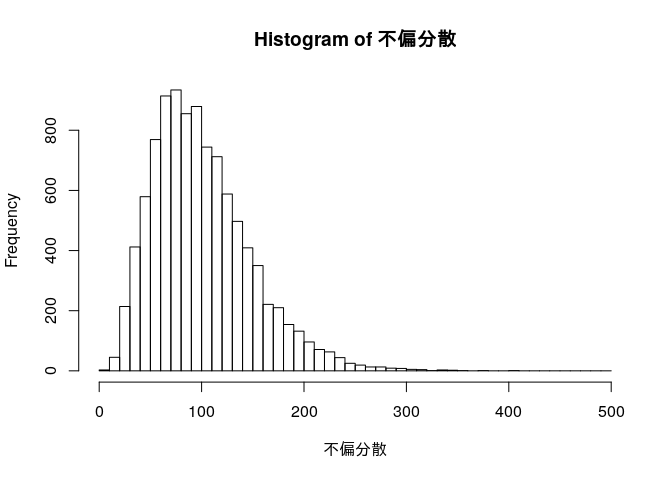

# 第4章 母集団と標本

## 4.2 推測統計の分類

  - 推測統計
      - 推定
          - 点推定
          - 区間推定
      - 検定

## 4.3 点推定

``` r
身長 <- c(165.2, 175.9, 161.7, 174.2, 172.1, 163.3, 170.9, 170.6, 168.4, 171.3)
mean(身長)
```

    ## [1] 169.36

## 4.4 推定値がどれくらいあてになるのかを調べる方法

X〜A

確率変数Xは確率分布Aにしたがう

正規分布

``` r
curve(dnorm(x,mean=0,sd=1),from=-4,to=4)
curve(dnorm(x,mean=1,sd=1),add=TRUE)
curve(dnorm(x,mean=0,sd=2),add=TRUE)
```

<!-- -->

N(0, 1)が標準正規分布

グラフの縦軸は確率密度

正規母集団から単純無作為抽出を行う

``` r
set.seed(1)
標本 <- rnorm(n=5,mean=50,sd=10)
標本
```

    ## [1] 43.73546 51.83643 41.64371 65.95281 53.29508

``` r
hist(標本)
```

<!-- -->

``` r
大標本 <- rnorm(n=10000,mean=50,sd=10)
hist(大標本)
```

<!-- -->

## 4.5 標本分布

正規分布にしたがう母集団の母平均を推定する

``` r
mean(rnorm(n=10,mean=50,sd=10))
```

    ## [1] 49.93376

``` r
mean(rnorm(n=10,mean=50,sd=10))
```

    ## [1] 46.93141

``` r
mean(rnorm(n=10,mean=50,sd=10))
```

    ## [1] 50.32397

モンテカルロシミュレーション

``` r
標本平均 <- replicate(10000, mean(rnorm(n=10,mean=50,sd=10)))
hist(標本平均)
```

<!-- -->

``` r
誤差絶対値5以下 <- abs(標本平均-50) <= 5
table(誤差絶対値5以下)
```

    ## 誤差絶対値5以下
    ## FALSE  TRUE 
    ##  1098  8902

``` r
mean(標本平均)
```

    ## [1] 49.98509

``` r
var(標本平均)
```

    ## [1] 9.823662

標本平均の標本分布

``` r
hist(標本平均,freq=FALSE)
curve(dnorm(x,mean=50,sd=sqrt(10)),add=TRUE)
```

<!-- -->

サンプルサイズを10倍にしてみる

``` r
標本平均 <- replicate(10000, mean(rnorm(n=100,mean=50,sd=10)))
var(標本平均)
```

    ## [1] 1.00379

``` r
hist(標本平均)
```

<!-- -->

## 4.6 標本平均以外の標本分布

``` r
library(purrr)

samples <- replicate(10000, rnorm(n=10,mean=50,sd=10), simplify = FALSE)
標本分散 <- samples %>% map_dbl(~ mean((. - mean(.))^2))
不偏分散 <- samples %>% map_dbl(var)
```

平均値

``` r
mean(標本分散)
```

    ## [1] 90.37223

``` r
mean(不偏分散)
```

    ## [1] 100.4136

標準偏差(標準誤差)

``` r
sd(標本分散)
```

    ## [1] 43.13801

``` r
sd(不偏分散)
```

    ## [1] 47.93112

``` r
hist(標本分散,breaks=seq(0,500,10))
```

<!-- -->

``` r
hist(不偏分散,breaks=seq(0,500,10))
```

<!-- -->

``` r
table(標本分散>=200)
```

    ## 
    ## FALSE  TRUE 
    ##  9803   197

``` r
table(不偏分散>=200)
```

    ## 
    ## FALSE  TRUE 
    ##  9621   379

中央値の標本分布

``` r
標本平均 <- samples %>% map_dbl(mean)
標本中央値 <- samples %>% map_dbl(median)
```

``` r
mean(標本平均)
```

    ## [1] 50.03056

``` r
mean(標本中央値)
```

    ## [1] 50.04682

``` r
sd(標本平均)
```

    ## [1] 3.171933

``` r
sd(標本中央値)
```

    ## [1] 3.723457
