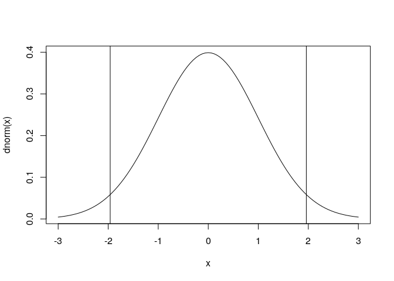

# 第5章 統計的仮説検定

## 5.3 標準正規分布を用いた検定

``` r
心理学テスト <- c(13,14,7,12,10,6,8,15,4,14,9,6,10,12,5,12,8,8,12,15)
Z統計量 <- (mean(心理学テスト)-12) / sqrt(10/length(心理学テスト))
Z統計量
```

    ## [1] -2.828427

``` r
qnorm(0.025)
```

    ## [1] -1.959964

``` r
qnorm(0.025,lower.tail=FALSE)
```

    ## [1] 1.959964

``` r
curve(dnorm(x),-3,3)
abline(v=qnorm(0.025))
abline(v=qnorm(0.975))
```

<!-- -->

p値を求める

``` r
2*pnorm(2.828427,lower.tail=FALSE)
```

    ## [1] 0.004677737

有意水準0.05よりも小さいので、帰無仮説は棄却される。

## 5.4 t分布を用いた検定

``` r
t統計量 <- (mean(心理学テスト)-12) / sqrt(var(心理学テスト)/length(心理学テスト))
t統計量
```

    ## [1] -2.616648

p値

``` r
2*pt(2.616648,19,lower.tail=FALSE)
```

    ## [1] 0.01697092

``` r
t.test(心理学テスト,mu=12)
```

    ## 
    ##  One Sample t-test
    ## 
    ## data:  心理学テスト
    ## t = -2.6166, df = 19, p-value = 0.01697
    ## alternative hypothesis: true mean is not equal to 12
    ## 95 percent confidence interval:
    ##   8.400225 11.599775
    ## sample estimates:
    ## mean of x 
    ##        10

## 5.5 相関係数の検定

``` r
統計テスト1 <- c(6,10,6,10,5,3,5,9,3,3,11,6,11,9,7,5,8,7,7,9)
統計テスト2 <- c(10,13,8,15,8,6,9,10,7,3,18,14,18,11,12,5,7,12,7,7)
```

``` r
標本相関 <- cor(統計テスト1, 統計テスト2)
サンプルサイズ <- length(統計テスト1)
t統計量 <- 標本相関*sqrt(サンプルサイズ-2) / sqrt(1-標本相関^2)
t統計量
```

    ## [1] 4.805707

p値

``` r
2*pt(4.805707,18,lower.tail=FALSE)
```

    ## [1] 0.0001416228

## 5.6 独立性の検定

``` r
数学 <- c("嫌い","嫌い","好き","好き","嫌い","嫌い","嫌い","嫌い","嫌い","好き","好き","嫌い","好き","嫌い","嫌い","好き","嫌い","嫌い","嫌い","嫌い")
統計 <- c("好き","好き","好き","好き","嫌い","嫌い","嫌い","嫌い","嫌い","嫌い","好き","好き","好き","嫌い","好き","嫌い","嫌い","嫌い","嫌い","嫌い")
table(数学,統計)
```

    ##       統計
    ## 数学 好き 嫌い
    ##   好き    4    2
    ##   嫌い    4   10

``` r
期待度数 <- c(12*14/20, 12*6/20, 8*14/20, 8*6/20)
観測度数 <- c(10,2,4,4)
カイ二乗 <- sum((観測度数-期待度数)^2/期待度数)
カイ二乗
```

    ## [1] 2.539683

p値

``` r
pchisq(2.539683,1,lower.tail=FALSE)
```

    ## [1] 0.1110171

## 5.7 サンプルサイズの検定結果への影響について

``` r
履修A <- matrix(c(16,12,4,8),2,2,
                dimnames=list(c("文系","理系"),c("履修した", "履修しない")))
履修A
```

    ##      履修した 履修しない
    ## 文系       16          4
    ## 理系       12          8

独立性の検定

``` r
chisq.test(履修A,correct=FALSE)
```

    ## 
    ##  Pearson's Chi-squared test
    ## 
    ## data:  履修A
    ## X-squared = 1.9048, df = 1, p-value = 0.1675

人数を10倍にする

``` r
履修B <- 履修A * 10
履修B
```

    ##      履修した 履修しない
    ## 文系      160         40
    ## 理系      120         80

``` r
chisq.test(履修B,correct=FALSE)
```

    ## 
    ##  Pearson's Chi-squared test
    ## 
    ## data:  履修B
    ## X-squared = 19.048, df = 1, p-value = 1.275e-05

サンプルサイズが大きくなると、検定の結果は有意になりやすい
