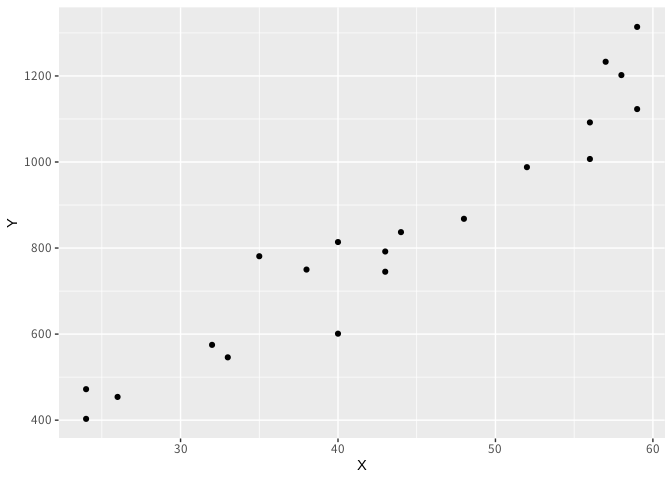
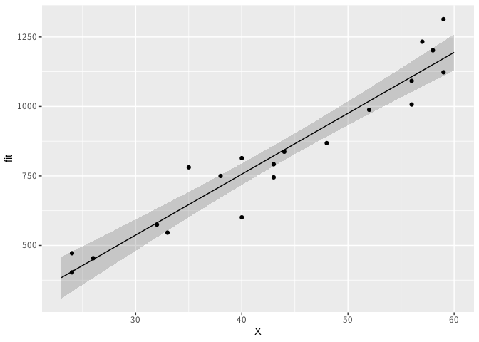
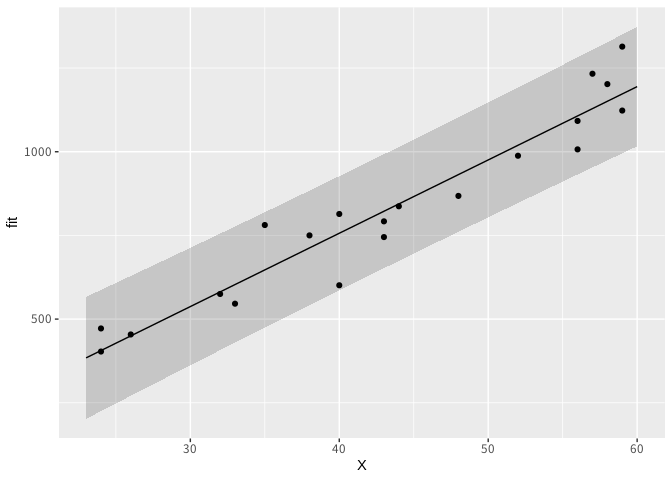
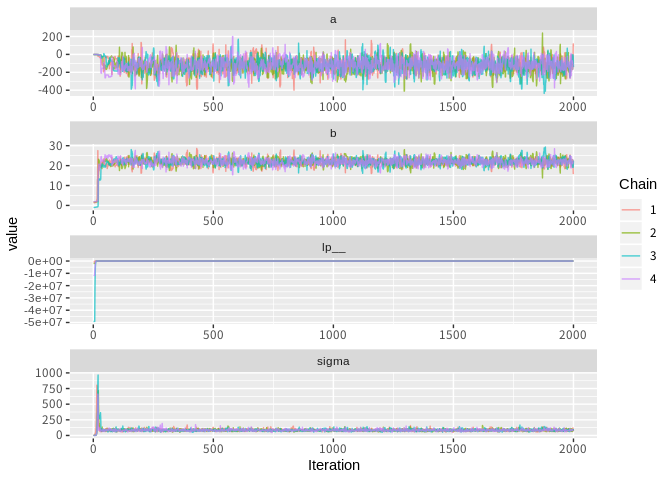
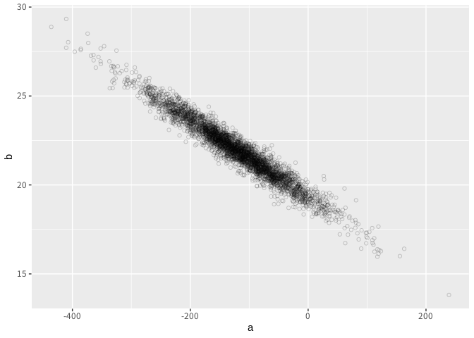

## 4.4 単回帰

``` r
library(rstan)
library(ggplot2)
library(ggmcmc)
```

``` r
d <- read.csv("RStanBook/chap04/input/data-salary.txt")
```

``` r
head(d)
```

    ##    X   Y
    ## 1 24 472
    ## 2 24 403
    ## 3 26 454
    ## 4 32 575
    ## 5 33 546
    ## 6 35 781

### 4.4.2 データの分布の確認

``` r
ggplot(d, aes(x = X, y = Y)) +
  geom_point()
```



### 4.4.4 Rのlm関数で推定

``` r
res_lm <- lm(Y ~ X, data = d)
res_lm
```

    ## 
    ## Call:
    ## lm(formula = Y ~ X, data = d)
    ## 
    ## Coefficients:
    ## (Intercept)            X  
    ##      -119.7         21.9

``` r
X_new <- data.frame(X = 23:60)
conf_95 <- predict(res_lm, X_new, interval = 'confidence', level = 0.95)
pred_95 <- predict(res_lm, X_new, interval = 'prediction', level = 0.95)
```

信頼区間

``` r
conf_95_df <- data.frame(X_new, conf_95)

ggplot() +
  geom_ribbon(data = conf_95_df, aes(x = X, ymin = lwr, ymax = upr), alpha = 0.2) +
  geom_line(data = conf_95_df, aes(x = X, y = fit)) +
  geom_point(data = d, aes(x = X, y = Y))
```



予測区間

``` r
pred_95_df <- data.frame(X_new, pred_95)

ggplot() +
  geom_ribbon(data = pred_95_df, aes(x = X, ymin = lwr, ymax = upr), alpha = 0.2) +
  geom_line(data = pred_95_df, aes(x = X, y = fit)) +
  geom_point(data = d, aes(x = X, y = Y))
```



### 4.4.5 Stanで実装

model4-5.stan

    data {
      int N;
      real X[N];
      real Y[N];
    }

    parameters {
      real a;
      real b;
      real<lower=0> sigma;
    }

    model {
      for (n in 1:N) {
        Y[n] ~ normal(a + b*X[n], sigma);
      }
    }

### 4.4.6 Rからの実行方法

``` r
data <- list(N = nrow(d), X = d$X, Y = d$Y)
fit <- stan(file = "RStanBook/chap04/model/model4-5.stan", data = data, seed = 1234)
```

### 4.4.7 RStanの結果の見方

``` r
fit
```

    ## Inference for Stan model: model4-5.
    ## 4 chains, each with iter=2000; warmup=1000; thin=1; 
    ## post-warmup draws per chain=1000, total post-warmup draws=4000.
    ## 
    ##          mean se_mean    sd    2.5%     25%     50%    75%  97.5% n_eff
    ## a     -121.53    2.05 75.97 -270.45 -167.02 -120.34 -73.00  26.46  1379
    ## b       21.96    0.05  1.69   18.71   20.84   21.93  23.00  25.30  1350
    ## sigma   85.09    0.37 15.38   61.62   73.63   83.07  94.33 121.28  1697
    ## lp__   -93.63    0.04  1.31  -96.87  -94.24  -93.29 -92.66 -92.13  1045
    ##       Rhat
    ## a        1
    ## b        1
    ## sigma    1
    ## lp__     1
    ## 
    ## Samples were drawn using NUTS(diag_e) at Sat Jun  8 21:30:12 2019.
    ## For each parameter, n_eff is a crude measure of effective sample size,
    ## and Rhat is the potential scale reduction factor on split chains (at 
    ## convergence, Rhat=1).

### 4.4.8 収束診断をファイルに出力する

``` r
ggs_traceplot(ggs(fit, inc_warmup = TRUE, stan_include_auxiliar = TRUE))
```



### 4.4.9 MCMCの設定の変更

``` r
stanmodel <- stan_model(file = "RStanBook/chap04/model/model4-5.stan")

fit <- sampling(
  stanmodel,
  data = data,
  pars = c("b", "sigma"),
  init = function() {
    list(a = runif(1, -10, 10), b = runif(1, 0, 10), sigma = 10)
  },
  seed = 123,
  chains = 3, iter = 1000, warmup = 200, thin = 2)
```

### 4.4.10 並列計算の実行方法

``` r
rstan_options(auto_write = TRUE)
options(mc.cores = parallel::detectCores())
```

### 4.4.11 ベイズ信頼区間とベイズ予測区間の算出

``` r
ms <- rstan::extract(fit)
```

``` r
head(ms$b)
```

    ## [1] 24.15536 22.24599 19.19261 23.76155 23.36382 22.34047

``` r
quantile(ms$b, probs = c(0.025, 0.975))
```

    ##     2.5%    97.5% 
    ## 18.71095 25.29837

``` r
d_mcmc <- as.data.frame(ms)[1:3]
head(d_mcmc)
```

    ##             a        b    sigma
    ## 1 -223.992425 24.15536 88.85238
    ## 2 -124.322589 22.24599 85.26421
    ## 3   -3.477732 19.19261 90.46450
    ## 4 -207.996472 23.76155 71.73823
    ## 5 -219.087116 23.36382 81.89906
    ## 6 -138.999775 22.34047 74.61260

``` r
ggplot(d_mcmc, aes(x = a, y = b)) +
  geom_point(shape = 1, alpha = 0.2)
```



50歳の人の基本年収の分布と年収の予測分布

``` r
N_mcmc <- length(ms$lp__)
y50_base <- ms$a + ms$b * 50
y50 <- rnorm(n = N_mcmc, mean = y50_base, sd = ms$sigma)
d_mcmc <- data.frame(a = ms$a, b = ms$b, sigma = ms$sigma, y50_base, y50)
```

### 4.4.12 transformed parametersブロックとgenerated quantitiesブロック

model4-4.stan

    data {
      int N;
      real X[N];
      real Y[N];
      int N_new;
      real X_new[N_new];
    }

    parameters {
      real a;
      real b;
      real<lower=0> sigma;
    }

    transformed parameters {
      real y_base[N];
      for (n in 1:N)
        y_base[n] = a + b*X[n];
    }

    model {
      for (n in 1:N)
        Y[n] ~ normal(y_base[n], sigma);
    }

    generated quantities {
      real y_base_new[N_new];
      real y_new[N_new];
      for (n in 1:N_new) {
        y_base_new[n] = a + b*X_new[n];
        y_new[n] = normal_rng(y_base_new[n], sigma);
      }
    }

``` r
X_new <- 23:60
data <- list(N = nrow(d), X = d$X, Y = d$Y, N_new = length(X_new), X_new = X_new)
fit <- stan(file = "RStanBook/chap04/model/model4-4.stan", data = data, seed = 1234)
ms <- rstan::extract(fit)
```

``` r
head(ms$y_new[, 1:4])
```

    ##           
    ## iterations     [,1]     [,2]     [,3]     [,4]
    ##       [1,] 297.0634 484.5695 552.4276 595.4844
    ##       [2,] 343.1046 459.1452 513.4794 537.1126
    ##       [3,] 521.3802 307.4424 511.2296 445.0194
    ##       [4,] 342.7133 350.9182 396.9592 457.5868
    ##       [5,] 326.9174 501.7314 531.4819 420.1802
    ##       [6,] 299.6998 247.0654 568.7789 353.6361
